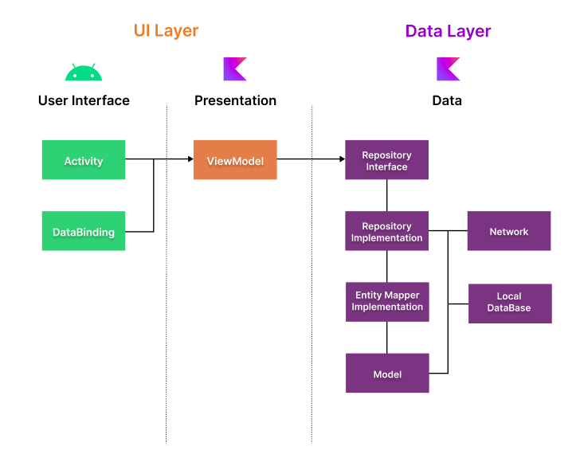
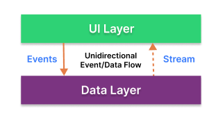
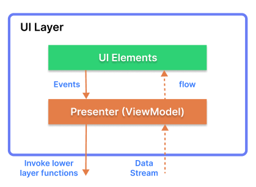
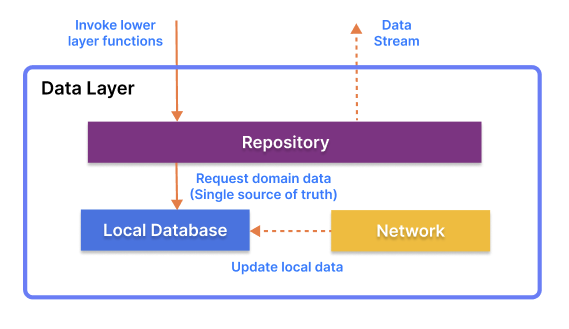
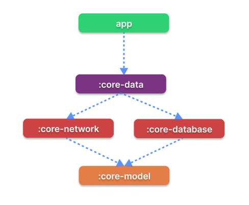

<h1 align="center">Pokedex</h1>

<p align="center">
  <a href="https://devlibrary.withgoogle.com/products/android/repos/skydoves-pokedex"></a><br>
  <a href="https://opensource.org/licenses/Apache-2.0"></a>
  <a href="https://android-arsenal.com/api?level=21"></a>
  <a href="https://github.com/skydoves/Pokedex/actions"></a> 
  <a href="https://proandroiddev.com/exploring-dagger-hilt-and-whats-main-differences-with-dagger-android-c8c54cd92f18"></a>
  <a href="https://github.com/skydoves"></a> 
</p>

<p align="center">  
🗡️ Pokedex demonstrates modern Android development with Hilt, Coroutines, Flow, Jetpack (Room, ViewModel), and Material Design based on MVVM architecture.
</p>
</br>

<p align="center">

</p>

## Download
Go to the [Releases](https://github.com/skydoves/Pokedex/releases) to download the latest APK.


## Tech stack & Open-source libraries
- Minimum SDK level 21
- [Kotlin](https://kotlinlang.org/) based, [Coroutines](https://github.com/Kotlin/kotlinx.coroutines) + [Flow](https://kotlin.github.io/kotlinx.coroutines/kotlinx-coroutines-core/kotlinx.coroutines.flow/) for asynchronous.
- Jetpack
  - Lifecycle: Observe Android lifecycles and handle UI states upon the lifecycle changes.
  - ViewModel: Manages UI-related data holder and lifecycle aware. Allows data to survive configuration changes such as screen rotations.
  - DataBinding: Binds UI components in your layouts to data sources in your app using a declarative format rather than programmatically.
  - Room: Constructs Database by providing an abstraction layer over SQLite to allow fluent database access.
  - [Hilt](https://dagger.dev/hilt/): for dependency injection.
- Architecture
  - MVVM Architecture (View - DataBinding - ViewModel - Model)
  - [Bindables](https://github.com/skydoves/bindables): Android DataBinding kit for notifying data changes to UI layers.
  - Repository Pattern
- [Retrofit2 & OkHttp3](https://github.com/square/retrofit): Construct the REST APIs and paging network data.
- [Sandwich](https://github.com/skydoves/Sandwich): Construct a lightweight and modern response interface to handle network payload for Android.
- [Moshi](https://github.com/square/moshi/): A modern JSON library for Kotlin and Java.
- [WhatIf](https://github.com/skydoves/whatif): Check nullable objects and empty collections more fluently.
- [Bundler](https://github.com/skydoves/bundler): Android Intent & Bundle extensions, which insert and retrieve values elegantly.
- [ksp](https://github.com/google/ksp): Kotlin Symbol Processing API.
- [Turbine](https://github.com/cashapp/turbine): A small testing library for kotlinx.coroutines Flow.
- [Material-Components](https://github.com/material-components/material-components-android): Material design components for building ripple animation, and CardView.
- [Glide](https://github.com/bumptech/glide), [GlidePalette](https://github.com/florent37/GlidePalette): Loading images from network.
- [TransformationLayout](https://github.com/skydoves/transformationlayout): Implementing transformation motion animations.
- Custom Views
  - [Rainbow](https://github.com/skydoves/rainbow): An easy way to apply gradations and tinting for Android.
  - [AndroidRibbon](https://github.com/skydoves/androidribbon): A simple way to implement a  beautiful ribbon with the shimmering on Android.
  - [ProgressView](https://github.com/skydoves/progressview): A polished and flexible ProgressView, fully customizable with animations.
- [Timber](https://github.com/JakeWharton/timber): A logger with a small, extensible API.

## Architecture
**Pokedex** is based on the MVVM architecture and the Repository pattern, which follows the [Google's official architecture guidance](https://developer.android.com/topic/architecture).



The overall architecture of **Pokedex** is composed of two layers; the UI layer and the data layer. Each layer has dedicated components and they have each different responsibilities, as defined below:

**Pokedex** was built with [Guide to app architecture](https://developer.android.com/topic/architecture), so it would be a great sample to show how the architecture works in real-world projects.


### Architecture Overview



- Each layer follows [unidirectional event/data flow](https://developer.android.com/topic/architecture/ui-layer#udf); the UI layer emits user events to the data layer, and the data layer exposes data as a stream to other layers.
- The data layer is designed to work independently from other layers and must be pure, which means it doesn't have any dependencies on the other layers.

With this loosely coupled architecture, you can increase the reusability of components and scalability of your app.

### UI Layer



The UI layer consists of UI elements to configure screens that could interact with users and [ViewModel](https://developer.android.com/topic/libraries/architecture/viewmodel) that holds app states and restores data when configuration changes.
- UI elements observe the data flow via [DataBinding](https://developer.android.com/topic/libraries/data-binding), which is the most essential part of the MVVM architecture. 
- With [Bindables](https://github.com/skydoves/bindables), which is an Android DataBinding kit for notifying data changes, you can implement two-way binding, and data observation in XML very clean.

### Data Layer



The data Layer consists of repositories, which include business logic, such as querying data from the local database and requesting remote data from the network. It is implemented as an offline-first source of business logic and follows the [single source of truth](https://en.wikipedia.org/wiki/Single_source_of_truth) principle.<br>

**Pokedex** is an offline-first app is an app that is able to perform all, or a critical subset of its core functionality without access to the internet. 
So users don't need to be up-to-date on the network resources every time and it will decrease users' data consumption. For further information, you can check out [Build an offline-first app](https://developer.android.com/topic/architecture/data-layer/offline-first).

## Modularization



**Pokedex** adopted modularization strategies below:

- **Reusability**: Modulizing reusable codes properly enable opportunities for code sharing and limits code accessibility in other modules at the same time.
- **Parallel Building**: Each module can be run in parallel and it reduces the build time.
- **Strict visibility control**: Modules restrict to expose dedicated components and access to other layers, so it prevents they're being used outside the module
- **Decentralized focusing**: Each developer team can assign their dedicated module and they can focus on their own modules.

For more information, check out the [Guide to Android app modularization](https://developer.android.com/topic/modularization).

## MAD Score


## Open API


Pokedex using the [PokeAPI](https://pokeapi.co/) for constructing RESTful API.<br>
PokeAPI provides a RESTful API interface to highly detailed objects built from thousands of lines of data related to Pokémon.

## Find this repository useful? :heart:
Support it by joining __[stargazers](https://github.com/skydoves/Pokedex/stargazers)__ for this repository. :star: <br>
Also, __[follow me](https://github.com/skydoves)__ on GitHub for my next creations! 🤩

# License
```xml
Designed and developed by 2022 skydoves (Jaewoong Eum)

Licensed under the Apache License, Version 2.0 (the "License");
you may not use this file except in compliance with the License.
You may obtain a copy of the License at

   http://www.apache.org/licenses/LICENSE-2.0

Unless required by applicable law or agreed to in writing, software
distributed under the License is distributed on an "AS IS" BASIS,
WITHOUT WARRANTIES OR CONDITIONS OF ANY KIND, either express or implied.
See the License for the specific language governing permissions and
limitations under the License.
```
